# 船舶故障诊断智能问答系统

> **Ship Fault Diagnosis & Q&A System** — 面向船舶装备故障诊断场景的智能化解决方案

**Streamlit 前端可视化 · 知识图谱推理 · 本地轻量模型**  |  `Python` · `Neo4j` · `YOLOv8n` · `Whisper` · `Ollama`

> 本仓库包含 **前端、知识图谱、模型轻量化** 三部分代码；**RAG（检索增强生成）链路由团队其他成员负责维护，未包含在本仓库中**。前端对 RAG 的调用已做降级处理，缺失该模块时自动返回空上下文，不影响其余功能独立运行。

---

## 界面预览（前端可视化）

<p align="center">
  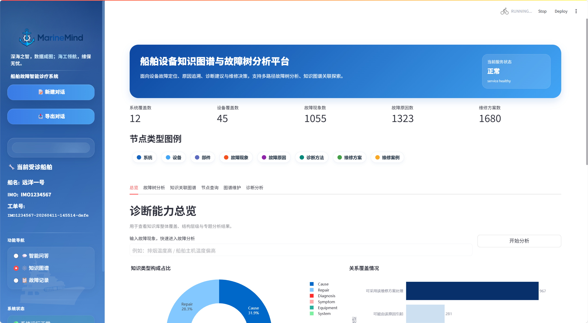
  <br><em>知识图谱总览页 —— 按设备 / 系统 / 故障现象 / 原因 / 维修方案多维可视化</em>
</p>

| 智能问答诊断（中文） | 故障树分析结果总览 |
|:---:|:---:|
|  | 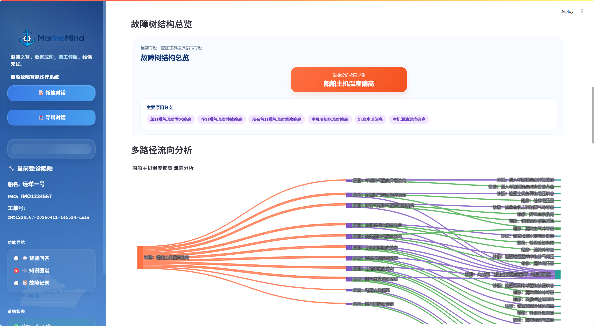 |

| 故障树多路径流向分析 | 图谱关系维护 |
|:---:|:---:|
| 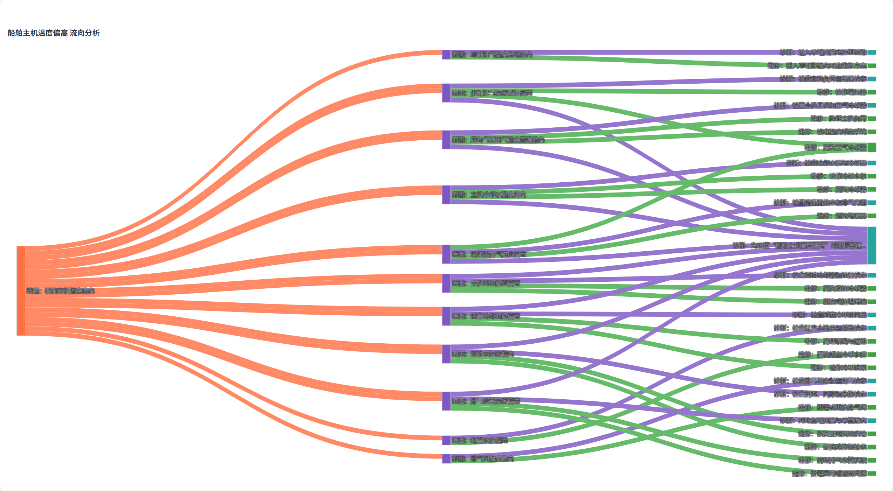 | 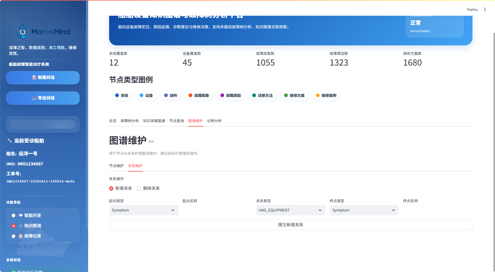 |

| 图谱节点维护 | 故障记录历史 |
|:---:|:---:|
| 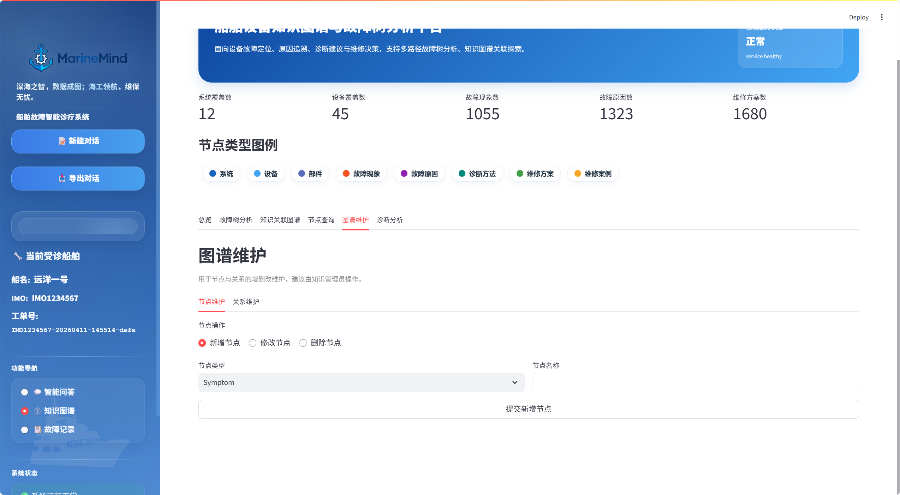 | 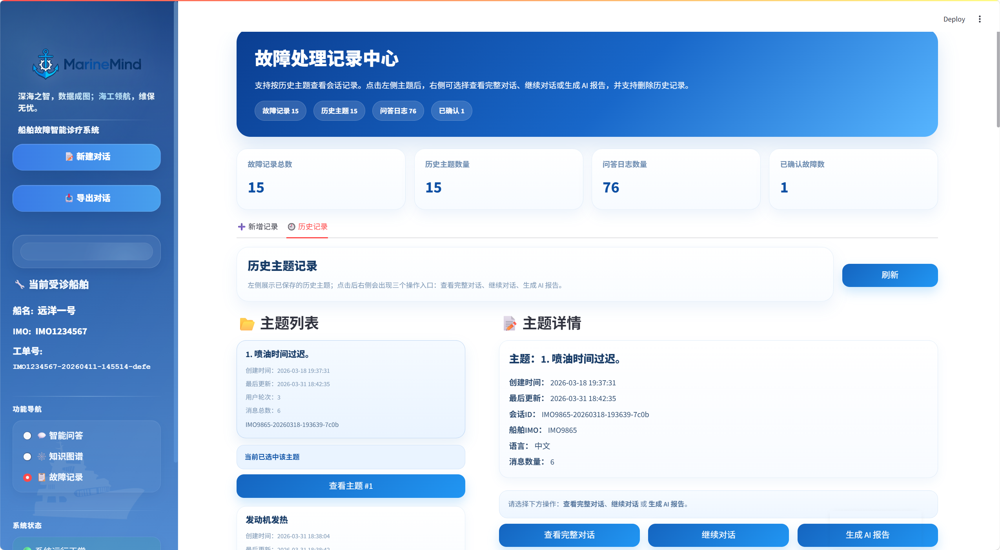 |

| 船舶诊断登录 | 语音诊断输入 |
|:---:|:---:|
| 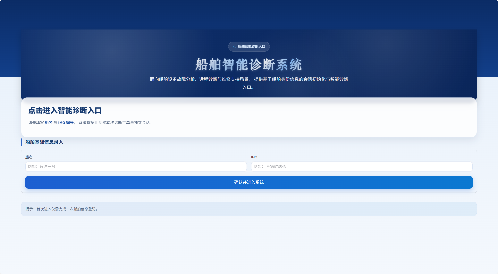 | 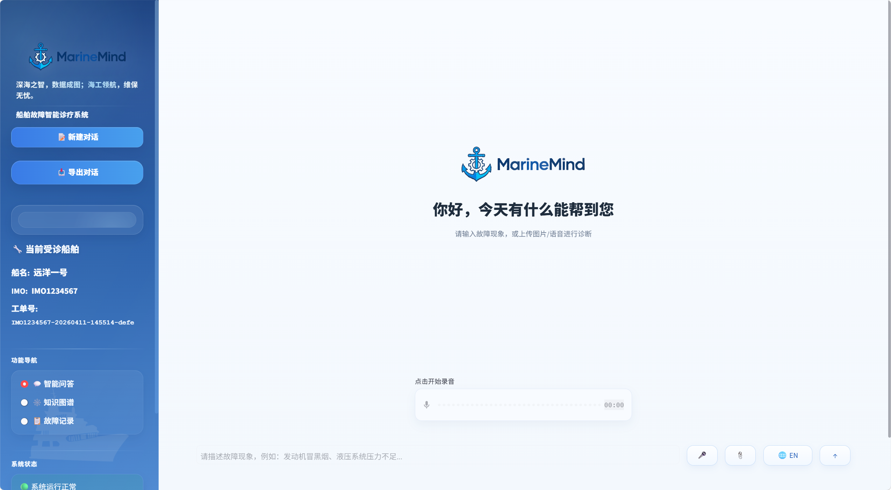 |

### 全部界面
| 页面 | 预览 |
|------|------|
| 优先排查建议页 | 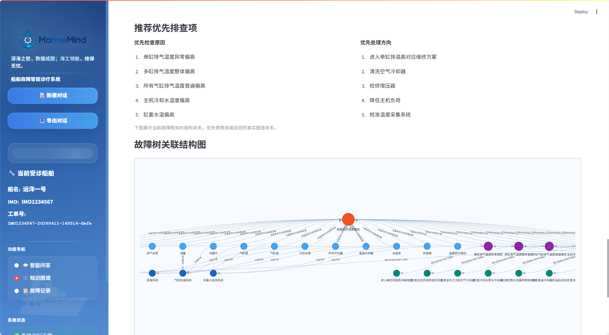 |
| 图片上传方式选择页 | 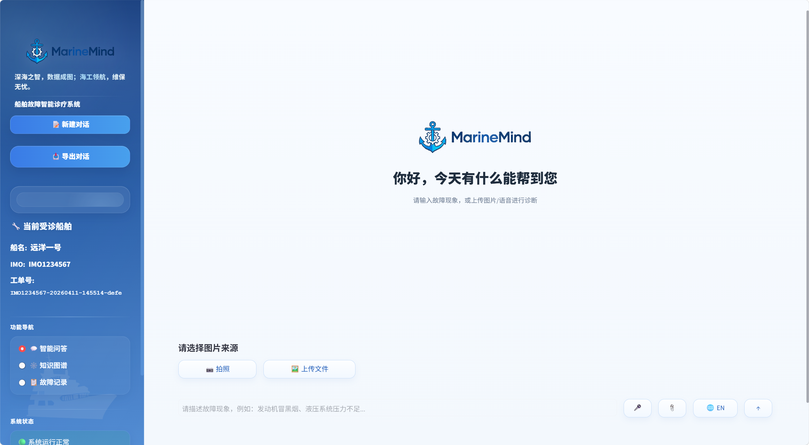 |
| 故障树分支选择页 | 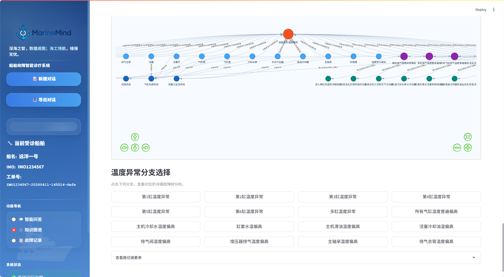 |
| 故障树分析输入页 | 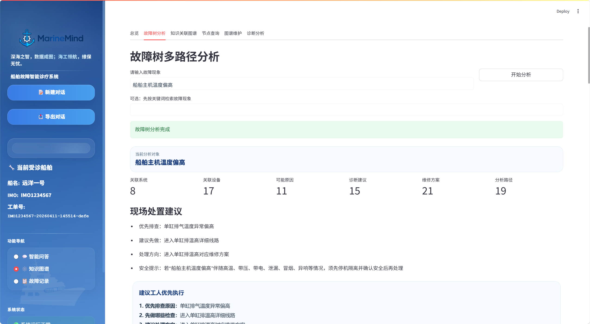 |
| 故障路径详情页 | 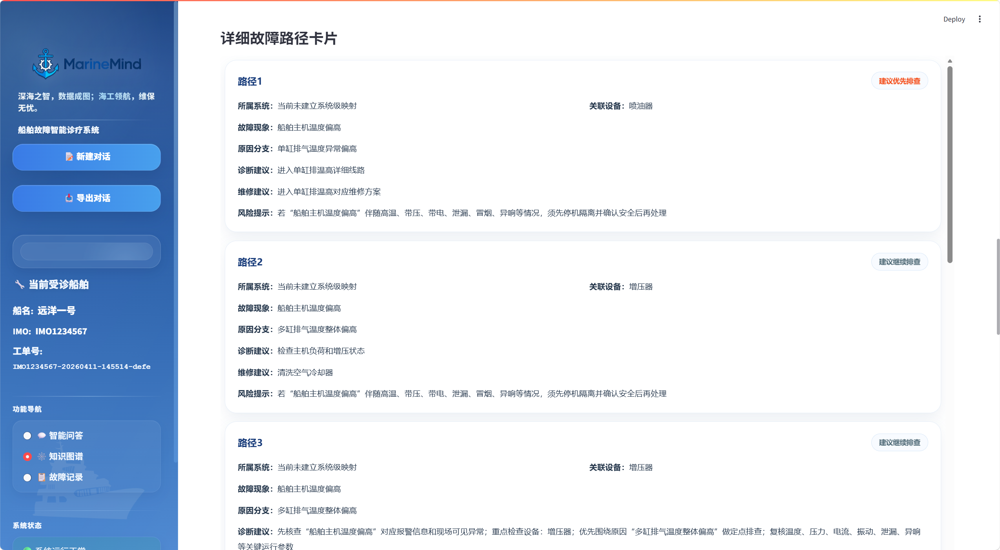 |
| 诊断分分析页 | 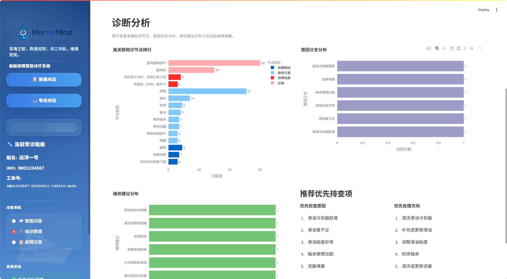 |
| 智能问答诊断界面（英文版） | 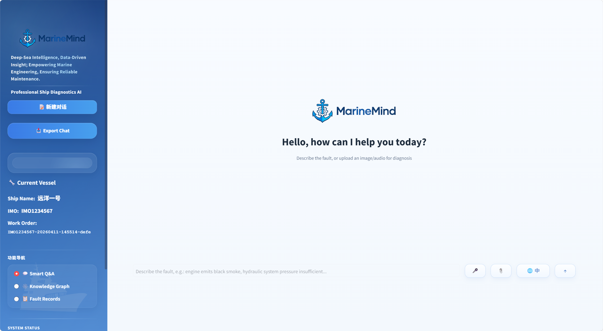 |
| 知识图谱总览分析页 | 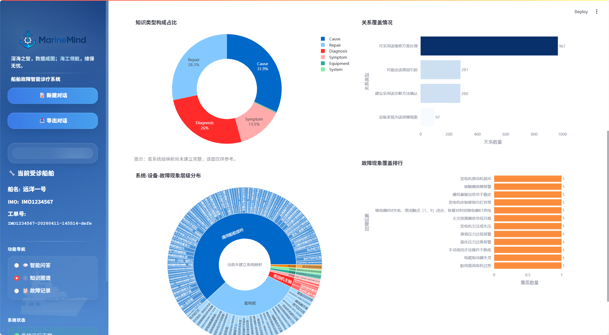 |
| 知识图谱关联页详情 | 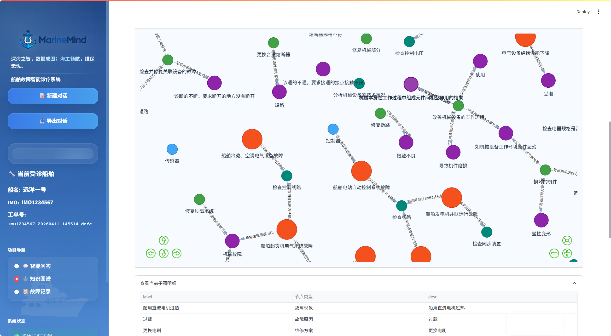 |
| 节点查询页 | 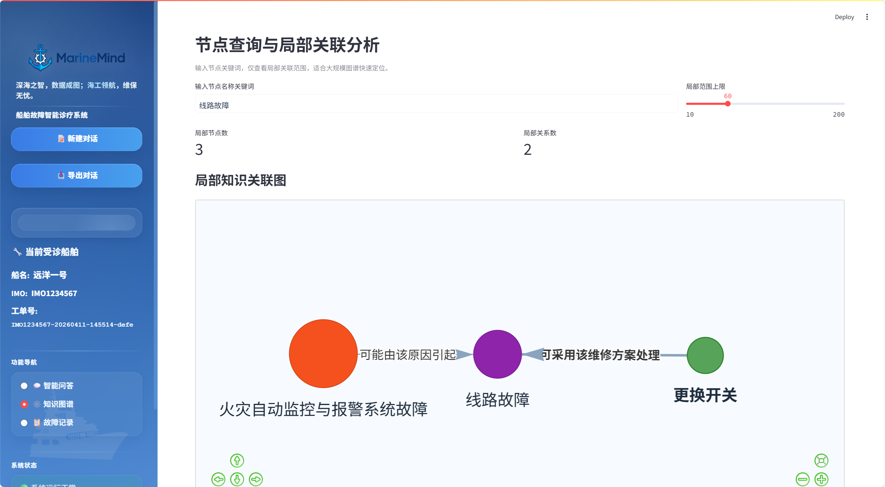 |
| 故障记录新增页 | 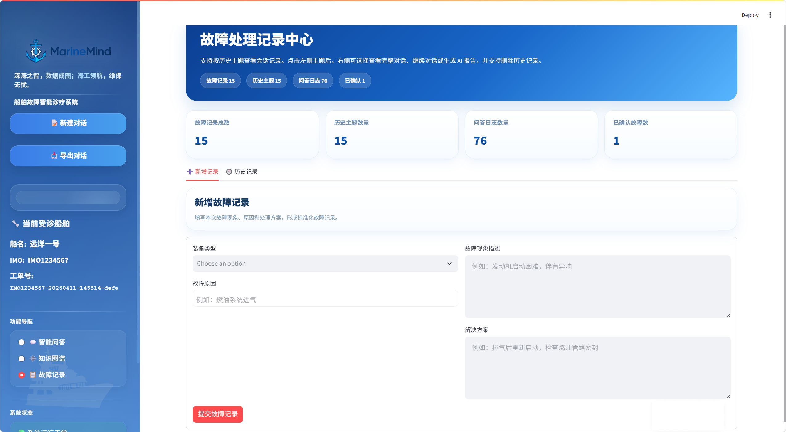 |

---

## 功能模块

### 1. 前端（Streamlit 应用）
- 知识图谱可视化（`streamlit-agraph` / `pyvis`）：按设备、系统、故障现象、原因、维修方案等维度展示与筛选
- 多轮图谱对话：基于知识图谱结构的专家问答（中 / 英双语）
- 故障案例管理与自学习：录入故障记录，一键推送知识图谱（含 LLM 结构化抽取）
- 语音输入（Whisper）与图像识别（YOLOv8n）入口
- 用户登录 / 会话管理与操作日志

| 文件 | 说明 |
|------|------|
| `app.py` | Streamlit 主程序（入口） |
| `database.py` | SQLite 数据层（会话、故障记录、日志） |
| `graph_chat.py` | 知识图谱多轮对话（LangGraph + DeepSeek R1） |
| `kg_client.py` | 知识图谱更新接口客户端 |
| `pic/` | 前端界面素材与效果图 |

### 2. 知识图谱（Neo4j）
- 图结构：`Symptom / Equipment / System / Cause / Repair / Diagnosis / MaintenanceCase` 等节点类型
- 7 类实体、16 类关系（`HAS_EQUIPMENT / BELONGS_TO / HAS_CAUSE / HAS_REPAIR / HAS_DIAGNOSIS / INSTANCE_OF / CONFIRMED_CAUSE / USED_REPAIR` …）
- 故障树层层递进结构 + 自学习机制（对话经验抽取为结构化 JSON 后写入图谱）
- Neo4j 增删改查后端服务（Flask，端口 5001）

| 路径 | 说明 |
|------|------|
| `A/backend/app.py` | 图谱 REST 后端（增删改查 / 故障树 / 自学习协议） |
| `A/data/` | 图谱数据（节点、关系、故障数据集） |
| `A/docs/` | 图谱结构说明、前端接入说明、协议样例 |
| `A/examples/` | 增删改与自学习示例 JSON |
| `A/scripts/verify_latest_graph.cypher` | Neo4j 验证查询 |
| `query_neo4j.py` | 图谱统计脚本（本地直连） |
| `import_ship_dataset_to_graph.py` | 故障数据集导入图谱 |

### 3. 模型轻量化（本地小模型部署）
面向部署资源受限的船舶场景，全部模型本地化、轻量化运行：

| 能力 | 模型 | 特点 |
|------|------|------|
| 大模型对话 | Qwen2.5-7B（Ollama 本地部署） | 7B 量化级本地推理，替代云端大模型 |
| 语音识别 | Whisper `tiny` | 极小参数量，CPU 可实时转写 |
| 图像检测 | YOLOv8n（nano） | 约 6MB，轻量目标检测（设备/部件识别） |

对应代码位于 `B/HAI/src/`（`image_handler.py` / `audio_handler.py`），模型文件 `B/HAI/models/yolov8n.pt`。

---

## 技术栈

| 领域 | 技术 |
|------|------|
| 前端 | Streamlit · streamlit-agraph · pyvis |
| 知识图谱 | Neo4j · Cypher · Flask（REST） |
| 对话引擎 | LangGraph · DeepSeek R1 |
| 模型轻量化 | YOLOv8n · Whisper tiny · Qwen2.5-7B（Ollama） |
| 数据层 | SQLite · JSON |

---

## 快速开始

### 环境要求
- Python 3.10+
- Neo4j Community（本地，`bolt://localhost:7687`）
- Ollama（本地大模型，可选：`ollama pull qwen2.5:7b`）
- ffmpeg（可选，语音处理）

### 安装依赖
```bash
pip install -r requests.txt
```

### 环境变量（敏感信息不写入仓库）
```bash
export NEO4J_PASSWORD='你的Neo4j密码'
export DEEPSEEK_API_KEY='你的DeepSeek API Key'   # graph_chat 多轮对话使用
```

### 启动
```bash
# 1. 启动 Neo4j 与图谱后端
neo4j console
python A/backend/app.py          # 图谱后端 :5001

# 2. 初始化图谱数据（首次）
python import_ship_dataset_to_graph.py

# 3. 启动前端
streamlit run app.py             # http://localhost:8501
```

### 图谱统计
```bash
export NEO4J_PASSWORD='你的Neo4j密码'
python query_neo4j.py
```

---

## 目录结构

```
.
├── app.py                  # Streamlit 前端入口
├── database.py             # SQLite 数据层
├── graph_chat.py           # 图谱多轮对话（LangGraph）
├── kg_client.py            # 图谱更新客户端
├── query_neo4j.py          # 图谱统计脚本
├── import_ship_dataset_to_graph.py
├── requests.txt            # 依赖清单
├── pic/                    # 前端界面效果图（20+ 界面截图）
├── A/                      # 知识图谱模块
│   ├── backend/            #   图谱 REST 后端（Flask）
│   ├── data/               #   图谱数据
│   ├── docs/               #   设计文档
│   ├── examples/           #   协议示例
│   └── scripts/            #   验证查询
└── B/HAI/                  # 模型轻量化模块
    ├── models/yolov8n.pt   #   轻量检测模型
    └── src/                #   语音 / 图像 / 图谱接口
```